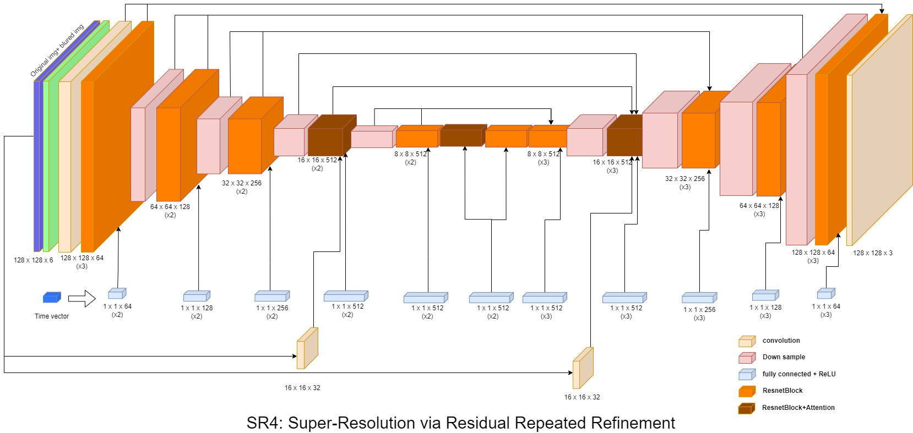
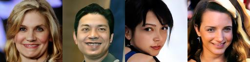

# Super-Resolution-with-Diffusion-Model
Super resolution with  Denoising Diffusion Probabilistic Models based on Image Super-Resolution via Iterative Refinement(SR3)
## Introduction
The method is based on conditional diffusion model. During inference, low resolution image is given as well as noise to generate high resolution with reverse diffusion model.
Previous method SR3 has disadvantages of slow sampling rate, computationally intensive and weak supervision from low resolution. The propose method aim to solve these issues with improved noise/learning rate schedule and modified reconstruction objective.
 
## Code instructions
Different settings in config folder include training and hyperparameter. 
Main code of training and evaluation
```
sr.py
```
Example training code is shown below (from scratch)
```
python sr.py -p val -c config/sr_sr3_16_128.json -lin_schedule False
```
Example evaluate code
```
python sr.py -p train -c config/sr_sr3_16_128.json -lin_schedule False
```
Main code of dataset generation from official format (FFHQ) with several folders.
```
python data/prepare_data.py  --path dataset/128 --out Out --size 16,128
```
training curve evaluation
```
tensorboard --logdir=tb_logger
```

## Results
 
